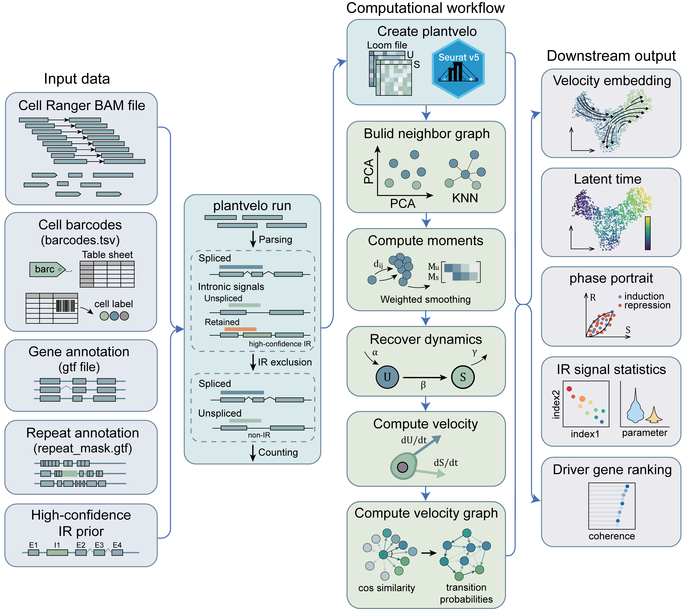

# PlantVelocity

**Plant RNA velocity with IR-excluded two-state dynamics**

PlantVelocity is an R package for estimating and visualizing RNA velocity in
plant single-cell transcriptomic data. It provides a workflow for recovering
splicing dynamics, projecting velocity onto low-dimensional embeddings,
inferring latent time and terminal states, and ranking putative driver genes.
Intron-retention (IR) signals can be analyzed independently as a post-hoc
feature, but are excluded from kinetic fitting and velocity inference.

<p align="center">
  
</p>

## Key applications

- Estimate RNA velocity from intron-excluded unspliced and spliced counts.
- Visualize cellular dynamics with velocity embeddings, grids, and streams.
- Infer latent time, cell origins, and terminal states.
- Identify putative driver genes from velocity coherence.
- Summarize and visualize IR-associated signals independently of the velocity
  model.
- Integrate loom-derived count layers with Seurat v5 objects.

## Installation

PlantVelocity requires R 4.1.0 or later. Install the development version from
GitHub with:

```r
if (!requireNamespace("remotes", quietly = TRUE)) {
  install.packages("remotes")
}

remotes::install_github("plantvelocity/PlantVelocity")
```

Required dependencies declared by PlantVelocity are installed automatically by
the installer. Optional features may require additional packages listed under
`Suggests` in `DESCRIPTION`.

## Quick start

The following example shows the main analysis path. See the package help topics
for input requirements, parameters, diagnostics, and optional analyses.

```r
library(PlantVelocity)

pv <- create_plantvelo(seob, loom_path = "plantvelo_output.loom")
pv <- build_neighbor_graph(pv)
pv <- compute_moments(pv)
pv <- recover_dynamics(pv)
pv <- compute_velocity(pv)
pv <- compute_velocity_graph(pv)
pv <- compute_velocity_embedding(pv, reduction = "umap")

plot_velocity_embedding(pv, reduction = "umap", group_by = "cell_type")
```

## Documentation

Detailed descriptions of functions, parameters, returned objects, and optional
workflows are available in the R help system:

```r
help(package = "PlantVelocity")
?create_plantvelo
?recover_dynamics
?plot_velocity_embedding
```

## Support

Please report bugs, unexpected behavior, and feature requests through
[GitHub Issues](https://github.com/plantvelocity/PlantVelocity/issues).

## Citation

A formal PlantVelocity publication and citation record are forthcoming. Until
then, please reference the
[PlantVelocity repository](https://github.com/plantvelocity/PlantVelocity) and
include the software version used in your analysis.
